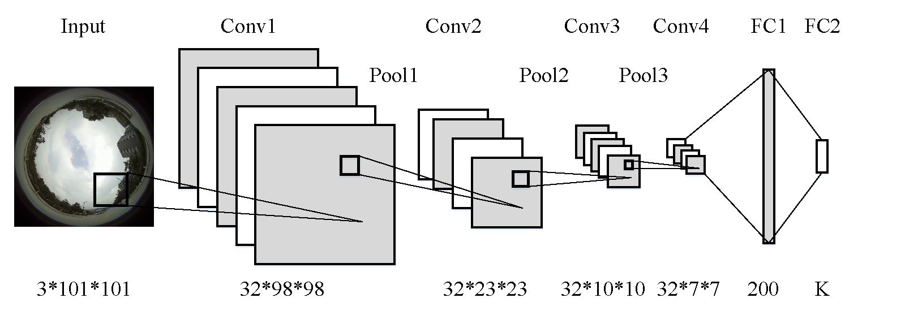
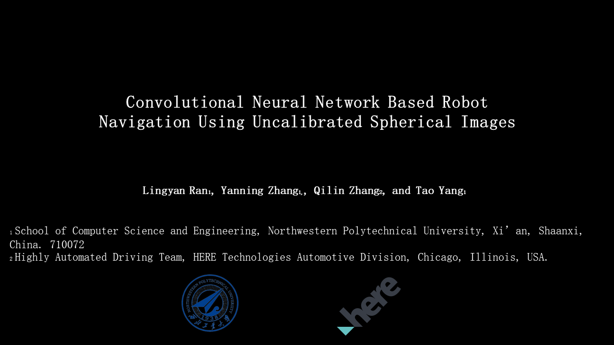

### Abstract
Vision-based mobile robot navigation is a vibrant area of research with numerous algorithms developed, with a vast majority of which either belong to the scene-oriented simultaneous localization and mapping (SLAM) or fall into the category of robot-oriented lane-detection/trajectory tracking. These methods suffer from high computational cost and require stringent labelling and calibration efforts. To address these challenges, this paper proposes a lightweight robot navigation framework based purely on uncalibrated spherical images. To simplify the orientation estimation, path prediction and improve computational efficiency, the navigation problem is decomposed into a series of classification tasks. To mitigate the adverse effects of insufficient negative samples in the "navigation via classification" task, we introduce the spherical camera for scene capturing, which enables $360^\circ$ fisheye panorama as training samples and generation of sufficient positive and negative heading directions. The classification is implemented as an end-to-end Convolutional Neural Network (CNN), trained on our proposed Spherical-Navi image dataset, whose category labels can be efficiently collected. This CNN is capable of predicting potential path directions with high confidence levels based on single, uncalibrated spherical image. Experimental results demonstrate that the proposed framework outperforms competing ones in realistic applications.

### Model

Proposed convolutional neural network based navigation framework. It consists of four convolutional layers, three pooling layers, and two fully connected layers. The inputs are raw, uncalibrated spherical images and the outputs are navigation signals (steering direction and angles).

### Data
Dataset can be downloaded [here](https://drive.google.com/open?id=0B2TeCRG1hB55eGV1V2FJb19Cd2s), or [here](http://dwz.cn/61ckOm). Total in size = 7.43G. 
Data was caputred 29frames/s. During training, frames are sampled 30 frames/s. Thus, 1 image ~= 1s. 

For data argumentation and labelling, please check Section 4.4 in our paper. 
`L.Ran, Y. Zhang, Q. Zhang, T. Yang, Convolutional Neural Network Based Robot Navigation Using Uncalibrated Spherical Images, 2017.`

For more information about the formatted images and labels, please contact us at  

### Performance
 [Demo](https://youtu.be/4ZjnVOa8cKA) video for navigation within campus.
Demo video is made with 15fps, ~= 15x faster than the original video.

### Reference
1. Ran, L.; Zhang, Y.; Yang, T.; Zhang, P. Autonomous Wheeled Robot Navigation with Uncalibrated Spherical Images. Chinese Conference on Intelligent Visual Surveillance. Springer, Singapore, 2016, pp. 47–55.
2. Giusti, A.; Guzzi, J.; Ciresan, D.; He, F.L.; Rodriguez, J.P.; Fontana, F.; Faessler, M.; Forster, C.; Schmidhuber, J.; Di Caro, G.; Scaramuzza, D.; Gambardella, L. A Machine Learning Approach to Visual Perception of Forest Trails for Mobile Robots. IEEE Robotics and Automation Letters 2016. 